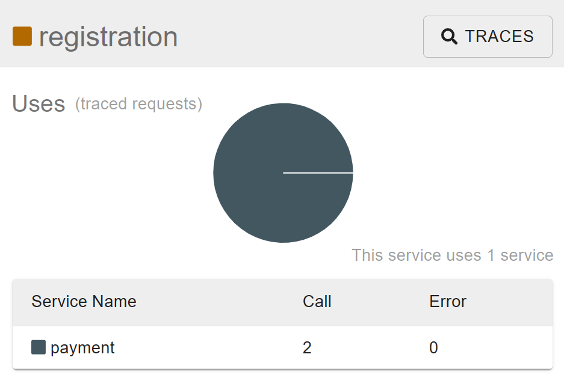

# Sync vs async messaging with Dapr and JavaScript

Examples of sync and async microservice messaging with Dapr and JavaScript.

## Prerequisites

Ensure you have the following installed before proceeding:

- [Docker Engine](https://docs.docker.com/engine/install/)
- [Dapr CLI](https://docs.dapr.io/getting-started/install-dapr-cli/)
- [NodeJS](https://nodejs.org/)
- Optional: [VS Code](https://code.visualstudio.com/) with the [REST client](https://marketplace.visualstudio.com/items?itemName=humao.rest-client) extension.

Run the following command in a terminal in the root of the repo to install the dependencies:

*For macOS & Linux*

```bash
npm run install:mac
```

*For Windows*

```bash
npm run install:win
```

Wait until all dependencies are installed.

## Synchronous messaging

Dapr services can communicate with each other using synchronous messaging. This is known as service-to-service invocation using a request/response model over HTTP or GRPC. Service A uses the DApr API to post a request. First this request arrives at the Dapr sidecar of service A. The sidecar will perform a name resolution to find out where the destination Dapr sidecar is for service B. The service A sidecar then forwards the request to the sidecar of service B which in turn delivers the request to service B itself. The response from service B flows through the sidecars back to service A.

The following diagram shows the flow of a synchronous request/response between two Dapr services, a Registration service and a Payment service:


### Run the sync messaging example

1. Open a terminal and navigate to the `sync` folder.
2. Run the apps with Dapr multi-app run (macOS or Linux only):

    ```bash
    dapr run -f .
    ```

   Or run the apps separately with the Dapr CLI:

    Navigate to the `payment` folder and run:

    ```bash
    dapr run --app-port 5502 --app-id payment --app-protocol http --dapr-http-port 3502 -- npm start
    ```

    Open a new terminal and navigate to the `registration` folder and run:

    ```bash
    dapr run --app-port 5501 --app-id registration --app-protocol http --dapr-http-port 3501 -- npm start
    ```

3. Make a request to the `register` endpoint of the registration service.

    > If you're using VS Code with the REST client you can use the [local-sync-test.http file](local-sync-test.http).

    ```bash
    curl --request POST \
    --url http://localhost:5501/register \
    --header 'content-type: application/json' \
    --data '{"name": "Stu Dent","email": "stu@dent.com","class": "digital media","cost": 500}'
    ```

    Expected response:

    ```txt
    Registration received for Stu Dent
    ```

    The application log of the payment service should show the following:

    ```txt
    == APP == Payment received: { email: 'stu@dent.com', cost: 500 }
    ```

    You've now successfully made a request to the registration service and that service made a synchronous call to the payment service.

### Add resiliency

The `sync/resources` folder contains a `resiliency.yaml` file that contains resiliency policies that the registration service will use when making requests to the payment service.

1. Inspect the [`resiliency.yaml`](sync/resources/resiliency.yaml) file and check the scope, policies, and target elements.
2. Open a terminal and navigate to the `registration` folder and run:

    ```bash
    dapr run --app-port 5502 --app-id registration --app-protocol http --dapr-http-port 3502 --resources-path ../resources -- npm start
    ```

    > Note that the `--resources-path` argument is used to specify the location of the `resiliency.yaml` file.

3. Ensure the `payment` service is no longer running. If it is running, stop the service to simulate an error with the service in order to trigger the resiliency policy.

4. Make a request to the `register` endpoint of the registration service.

    > If you're using VS Code with the REST client you can use the [local-sync-test.http file](local-sync-test.http).

    ```bash
    curl --request POST \
    --url http://localhost:5501/register \
    --header 'content-type: application/json' \
    --data '{"name": "Stu Dent","email": "stu@dent.com","class": "digital media","cost": 500}'
    ```

    Expected response:

    ```txt
    INFO[XXXX] Error processing operation endpoint[payment, payment:pay]. Retrying in 5s…
    ```

5. Before the request times out, open a new terminal and navigate to the `payment` folder and start the payment service:

    ```bash
    dapr run --app-port 5501 --app-id registration --app-protocol http --dapr-http-port 3501 -- npm start
    ```

    Expected application log for the registration service:

    ```txt
    INFO[XXX] Recovered processing operation endpoint[payment, payment:pay]
    ```

    Now you know how to use resiliency policies to handle transient errors when doing synchronous messaging with Dapr.

## Asynchronous messaging

Dapr services can communicate asynchronously with each other using a publish/subscribe model. This involves an intermediary service known as a message broker. Service A uses the Dapr API to publish an message. The message arrives at the sidecar of service A which publishes the message to a topic on the message broker. The sidecar of service B is subscribed to that topic, receives the message and forwards it to service B. The following diagram shows the flow of an asynchronous publish/subscribe between two Dapr services, a Register service and a Payment service:


### Run the async messaging example

1. Open a terminal and navigate to the `async` folder.
2. Run the apps with Dapr multi-app run (macOS or Linux only):

    ```bash
    dapr run -f .
    ```

   Or run the apps separately with the Dapr CLI:

    Navigate to the `payment` folder and run:

    ```bash
    dapr run --app-port 5512 --app-id payment --app-protocol http --dapr-http-port 3512 --resources-path ../resources/ -- npm start
    ```

    Open a new terminal and navigate to the `registration` folder and run:

    ```bash
    dapr run --app-port 5511 --app-id registration --app-protocol http --dapr-http-port 3511 --resources-path ../resources/ -- npm start
    ```

3. Make a request to the `register` endpoint of the registration service.

    > If you're using VS Code with the REST client you can use the [local-async-test.http file](local-async-test.http).

    ```bash
    curl --request POST \
    --url http://localhost:5511/register \
    --header 'content-type: application/json' \
    --data '{"name": "Stu Dent","email": "stu@dent.com","class": "digital media","cost": 500}'
    ```

    Expected response:

    ```txt
    Registration received for Stu Dent
    ```

    The application log of the payment service should show the following:

    ```txt
    == APP == Payment received: { email: 'stu@dent.com', cost: 500 }
    ```

    You've now successfully made a request to the registration service and that service published a message to the `newstudents` topic of the message broker. Since the payment service is subscribed to this topic it received the event and made a log statement to the console.

4. Open the Zipkin dashboard at http://localhost:9411/zipkin/ to inspect the traces.
5. In the menu, go to *dependencies* and click the search button (you might need to update the start time to before you started to make the requests). You should now see a visual representation of the communication between the services.

    

6. To analyze this further you can:
   - Click on the `registration` service and click the *Traces* button.

    

   - Click Run query. If there are no results you probably need to update the lookback range under the settings cog.
   - The page should now lists the traces of the registration service.
   - Find the trace that has the root: `registration: /v1.0/publish/studentpubsub/newstudents` and click on the *SHOW* button.

    

   - Now you see a timeline that shows both the `registration` and the `payment` services.

    